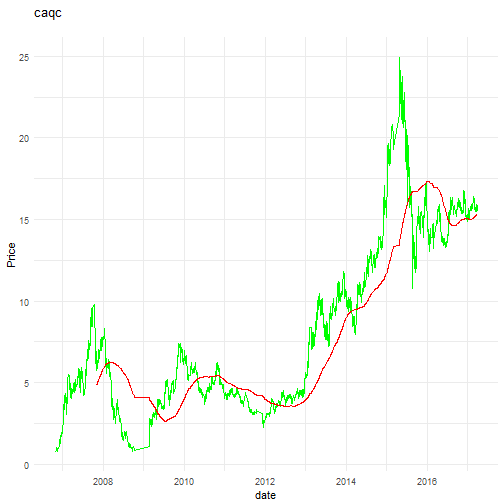
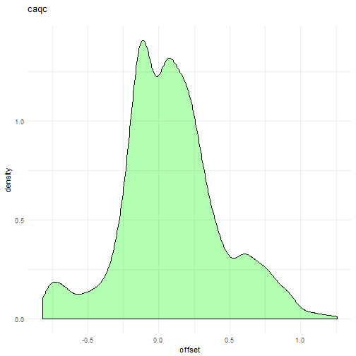

<!-- knit('../main.Rmd', 'main.md') -->


## 原始数据概览


```
##       date                 open             high             low        
##  Min.   :2006-10-30   Min.   : 0.730   Min.   : 0.800   Min.   : 0.720  
##  1st Qu.:2009-08-06   1st Qu.: 4.120   1st Qu.: 4.210   1st Qu.: 4.025  
##  Median :2012-03-19   Median : 5.920   Median : 6.105   Median : 5.770  
##  Mean   :2012-02-03   Mean   : 8.092   Mean   : 8.282   Mean   : 7.914  
##  3rd Qu.:2014-08-20   3rd Qu.:12.287   3rd Qu.:12.512   3rd Qu.:12.090  
##  Max.   :2017-03-31   Max.   :26.120   Max.   :26.120   Max.   :24.310  
##      close            volume             turnover        
##  Min.   : 0.790   Min.   :   145100   Min.   :5.864e+05  
##  1st Qu.: 4.130   1st Qu.: 12990332   1st Qu.:1.206e+08  
##  Median : 5.920   Median : 22094928   Median :2.531e+08  
##  Mean   : 8.101   Mean   : 28199849   Mean   :3.631e+08  
##  3rd Qu.:12.322   3rd Qu.: 35352504   3rd Qu.:4.414e+08  
##  Max.   :24.960   Max.   :221545430   Max.   :5.536e+09
```

## 给数据扩展新的字段


```r
train$weekday <- wday(train$date) - 1
train$month <- month(train$date)
train$rose <- round(train$close / train$open - 1, 4)
train$turn_vol <- round(train$turnover / train$volume, 4)
train$mean_hl <- round(0.5 * (train$high + train$low), 4)
train$mean_co <- round(0.5 * (train$close + train$open), 4)
train$mean_ochl <- round(0.5 * (train$mean_hl + train$mean_co), 4)
train$range <- train$high-train$low;
train$body <- abs(train$close-train$open);
train$vibrate <- round(train$range / train$open, 4)
train$body_range <- round(train$body / train$range, 4)
train$up_shadow <- round((train$high - ifelse(train$rose > 0, train$close, train$open)) / train$range, 4)
train$down_shadow <- round((ifelse(train$rose > 0, train$open, train$close) - train$low) / train$range, 4)
train$shadow_diff <- train$up_shadow - train$down_shadow
```

## 添加时间序列相关字段


```r
train$sma <- SMA(train$close, n=stk$period)
train$offset <- round(train$close / train$sma - 1, 4)
```

## 扩展后的数据概览


```r
summary(train)
```

```
##       date                 open             high             low        
##  Min.   :2006-10-30   Min.   : 0.730   Min.   : 0.800   Min.   : 0.720  
##  1st Qu.:2009-08-06   1st Qu.: 4.120   1st Qu.: 4.210   1st Qu.: 4.025  
##  Median :2012-03-19   Median : 5.920   Median : 6.105   Median : 5.770  
##  Mean   :2012-02-03   Mean   : 8.092   Mean   : 8.282   Mean   : 7.914  
##  3rd Qu.:2014-08-20   3rd Qu.:12.287   3rd Qu.:12.512   3rd Qu.:12.090  
##  Max.   :2017-03-31   Max.   :26.120   Max.   :26.120   Max.   :24.310  
##                                                                         
##      close            volume             turnover            weekday     
##  Min.   : 0.790   Min.   :   145100   Min.   :5.864e+05   Min.   :1.000  
##  1st Qu.: 4.130   1st Qu.: 12990332   1st Qu.:1.206e+08   1st Qu.:2.000  
##  Median : 5.920   Median : 22094928   Median :2.531e+08   Median :3.000  
##  Mean   : 8.101   Mean   : 28199849   Mean   :3.631e+08   Mean   :3.004  
##  3rd Qu.:12.322   3rd Qu.: 35352504   3rd Qu.:4.414e+08   3rd Qu.:4.000  
##  Max.   :24.960   Max.   :221545430   Max.   :5.536e+09   Max.   :5.000  
##                                                                          
##      month             rose             turn_vol         mean_hl      
##  Min.   : 1.000   Min.   :-0.15650   Min.   : 3.384   Min.   : 0.765  
##  1st Qu.: 4.000   1st Qu.:-0.01650   1st Qu.: 8.640   1st Qu.: 4.125  
##  Median : 7.000   Median : 0.00000   Median :11.302   Median : 5.938  
##  Mean   : 6.548   Mean   : 0.00252   Mean   :11.591   Mean   : 8.098  
##  3rd Qu.: 9.000   3rd Qu.: 0.01970   3rd Qu.:15.184   3rd Qu.:12.306  
##  Max.   :12.000   Max.   : 0.22860   Max.   :25.718   Max.   :25.010  
##                                                                       
##     mean_co         mean_ochl           range             body       
##  Min.   : 0.760   Min.   : 0.7625   Min.   :0.0000   Min.   :0.0000  
##  1st Qu.: 4.135   1st Qu.: 4.1300   1st Qu.:0.1800   1st Qu.:0.0500  
##  Median : 5.925   Median : 5.9325   Median :0.2800   Median :0.1100  
##  Mean   : 8.097   Mean   : 8.0973   Mean   :0.3671   Mean   :0.1801  
##  3rd Qu.:12.346   3rd Qu.:12.3287   3rd Qu.:0.4700   3rd Qu.:0.2300  
##  Max.   :25.395   Max.   :25.1200   Max.   :3.1200   Max.   :1.8500  
##                                                                      
##     vibrate          body_range       up_shadow       down_shadow    
##  Min.   :0.00000   Min.   :0.0000   Min.   :0.0000   Min.   :0.0000  
##  1st Qu.:0.02940   1st Qu.:0.2340   1st Qu.:0.1071   1st Qu.:0.1000  
##  Median :0.04435   Median :0.4545   Median :0.2353   Median :0.2208  
##  Mean   :0.05253   Mean   :0.4606   Mean   :0.2751   Mean   :0.2643  
##  3rd Qu.:0.06673   3rd Qu.:0.6786   3rd Qu.:0.4211   3rd Qu.:0.3963  
##  Max.   :0.32680   Max.   :1.0000   Max.   :0.9583   Max.   :1.0000  
##                    NA's   :10       NA's   :10       NA's   :10      
##   shadow_diff            sma             offset        
##  Min.   :-1.00000   Min.   : 2.638   Min.   :-0.81660  
##  1st Qu.:-0.20000   1st Qu.: 4.320   1st Qu.:-0.12750  
##  Median : 0.00000   Median : 5.447   Median : 0.06580  
##  Mean   : 0.01086   Mean   : 7.932   Mean   : 0.08634  
##  3rd Qu.: 0.22560   3rd Qu.:11.177   3rd Qu.: 0.26670  
##  Max.   : 0.93750   Max.   :17.356   Max.   : 1.25780  
##  NA's   :10         NA's   :239      NA's   :239
```

## 设置ggplot2主题


```r
theme_set(theme_minimal())
```

## 绘制收盘价曲线


```r
ggplot(train, aes(x = date)) +
  geom_line(aes(y = close), color='green') +
  geom_line(aes(y = sma), color='red') +
  scale_y_continuous("Price") +
  ggtitle(paste(code, '\n'))
```



## 绘制价格偏离移动平均值的分布曲线


```r
ggplot(train, aes(x = offset)) +
  geom_density(alpha = 0.3, fill = 'green') +
  ggtitle(paste(code, '\n'))
```


